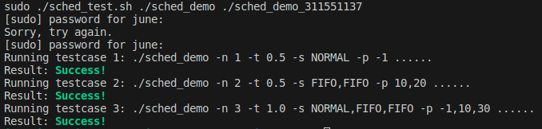

# Assignment 2: Scheduling Policy Demonstration Program

- Click [here](https://hackmd.io/@Bmch4MS0Rz-VZWB74huCvw/rJ8OLx6fp) for the assignment description.

- OS: Ubuntu 22.04 AMD64 / ARM64

- You can test the program with the command:

    `sudo ./sched_test.sh ./sched_demo ./sched_demo_311551137`

    or just

    `make test`

- Expected result:

    

- You can also running the commands `make` to observe the scheduling behaviors for the given cases. However, due to some environment issue, the FIFO policy will fail.

    